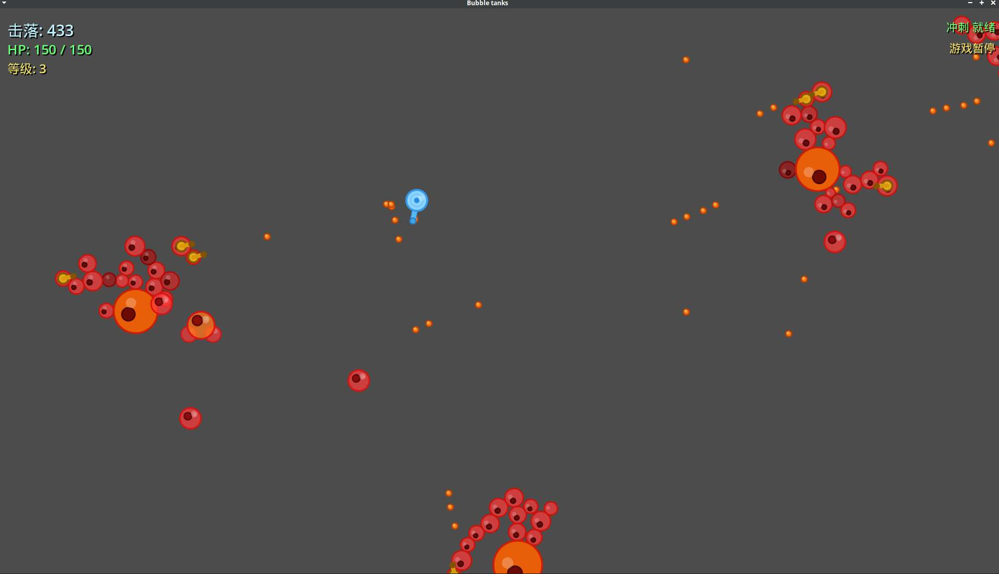

# Bubble Tanks

一个使用 Godot 4 制作的 2D 生存射击项目。

项目特点：

- 2D 生存射击玩法
- 运行时 Boss 进化与形态生成
- 多阶段 Boss 战斗与最终 Boss 关卡
- 针对生成尖峰与弹幕场景做过性能优化

当前仓库包含：

- 游戏源码与场景文件
- 音频、美术资源
- Boss 进化与形态生成逻辑
- 导出配置 `export_presets.cfg`

当前仓库不包含：

- Godot 本地缓存目录 `.godot/`
- Python 虚拟环境 `.venv/`
- 导出产物，例如网页导出文件或平台二进制包

## 运行环境

- Godot 4.6

## 当前版本

- `0.0.10`

## 运行方式

1. 用 Godot 打开项目目录。
2. 主场景在 `Main.tscn`。
3. 直接运行项目即可。

## 主要文件

- `project.godot`: Godot 项目配置
- `Main.gd`: 游戏主流程、生成、暂停、音频与对象池管理
- `Turret.gd`: 玩家控制与射击逻辑
- `EnemyBoss.gd`: Boss 行为、形态生成与战斗逻辑
- `BossEvolution.gd`: 运行时 Boss 进化系统
- `EnemyGenomeFactory.gd`: Boss 基因与形态生成辅助

## 仓库建议

推荐只提交源码、资源和配置文件，不提交导出后的网页或二进制文件。

推荐提交的内容包括：

- `.gd`
- `.tscn`
- `.godot` 以外的资源文件
- `.import`
- `.uid`
- `project.godot`
- `export_presets.cfg`

## 客户端更新与发布

- 发布形式改为平台压缩包，而不是直接分发裸二进制。
- 客户端启动后会读取 `res://version.json`，请求远端 `manifest.json`，发现新版本后提示用户下载更新。
- 下载过程会显示包体大小、实时速度和进度条；下载完成后会调用包内 `updater/` 安装脚本替换文件并重启游戏。
- GitHub Actions 工作流位于 `.github/workflows/release.yml`，会导出、打包、生成 `manifest.json` 和 `checksums.txt`，并在打 tag 时上传到 GitHub Releases。
- 本地开发默认不会检查更新；只有打包产物里的 `version.json` 被工作流注入实际仓库地址后，更新功能才会启用。

### 发布步骤

1. 确认 `version.json` 里的版本号。
2. 推送 tag，例如 `0.0.10`。
3. GitHub Actions 自动导出四个平台包、生成 manifest 并发布 Release。
4. 客户端下一次启动会读取 GitHub Pages 上的 `manifest.json` 检查更新。
